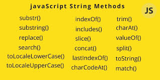
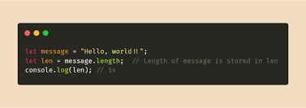
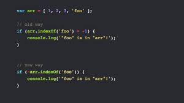
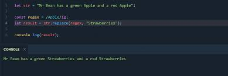
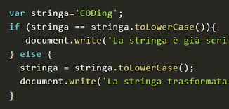

# Что такое Мето в JS

В JavaScript методы используются для управления объектами . Они пишутся так же, как функции, но определяются внутри объекта. Методы обычно используются для доступа к данным, хранящимся в объекте, и управления ими. Например, вы можете использовать метод length, чтобы узнать длину строки.

## Методи String в JS 

### JavaScript Свойство length
Свойство length возвращает длину строки:

### JavaScript Метод indexOf()
Метод indexOf() возвращает индекс (положение) на first вхождения указанного текста в строке.

Метод lastIndexOf() возвращает индекс последнего вхождения указанного текста в строке.

Оба indexOf(), и lastIndexOf() возвращают -1, если текст не найден.

### JavaScript Метод search()
Метод search() ищет строку для указанного значения и возвращает позицию матча

### JavaScript Метод slice()
Метод slice() извлекает часть строки и возвращает извлеченную часть в новой строке.

Метод принимает 2 параметра: начальную позицию и конечную позицию (конец не включен).

В этом примере часть строки вырезается из позиции 7 в позицию 12 (13-1)

### JavaScript Метод substring()
Метод substring() похоже на slice().

Разница в том, что substring() не может принимать отрицательные индексы.

### JavaScript Метод substr()
Метод substr() похоже на slice().

Разница в том, что второй параметр указывает длину извлеченной части.

### JavaScript Метод replace()
Метод replace() заменяет указанное значение с другим значением в строке

### JavaScript Метод toUpperCase()
Строка преобразуется в верхний регистр с помощью toUpperCase()

### JavaScript Метод toLowerCase()
Строка преобразуется в нижний регистр с помощью toLowerCase()

### JavaScript Метод concat()
Метод concat() объединяет две или более строк.

Этот concat() метод можно использовать вместо оператора плюс. Эти две строки делают то же самое

### JavaScript Метод charAt
Метод charAt() возвращает символ по указанному индексу (позиции) в строке.

